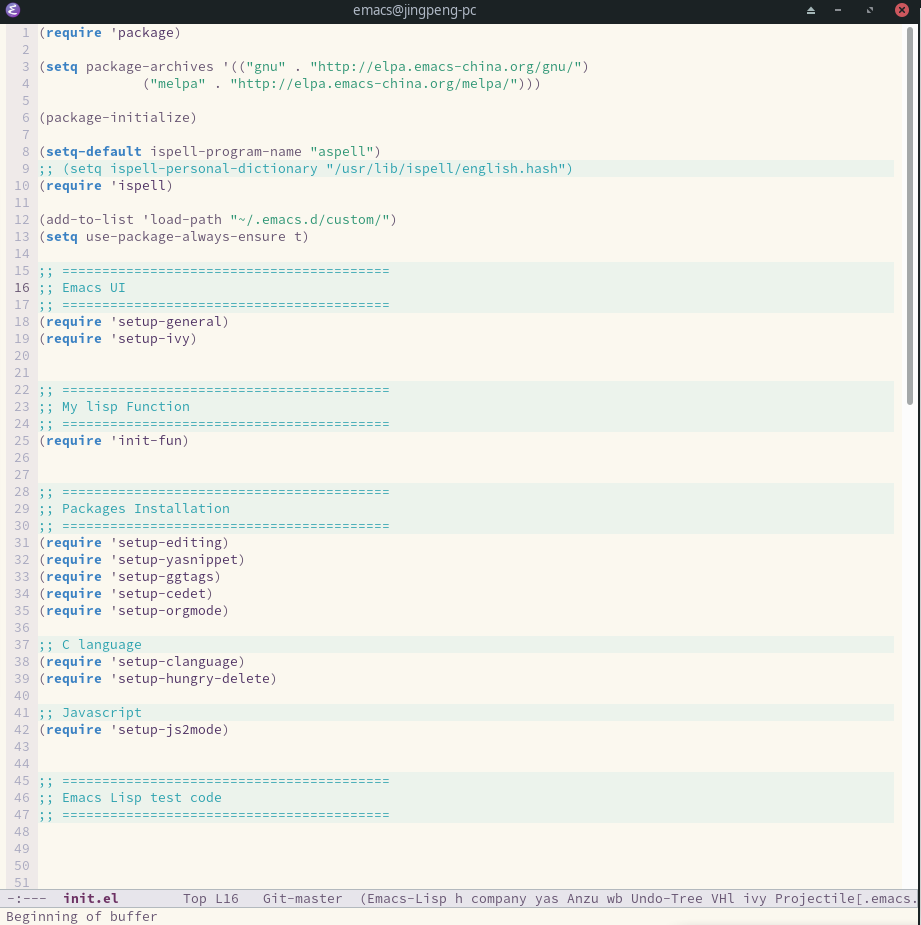
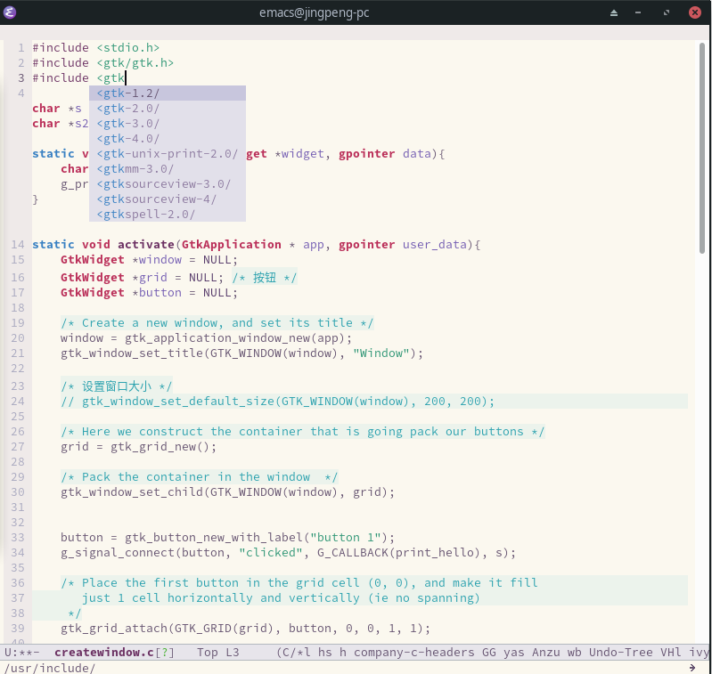
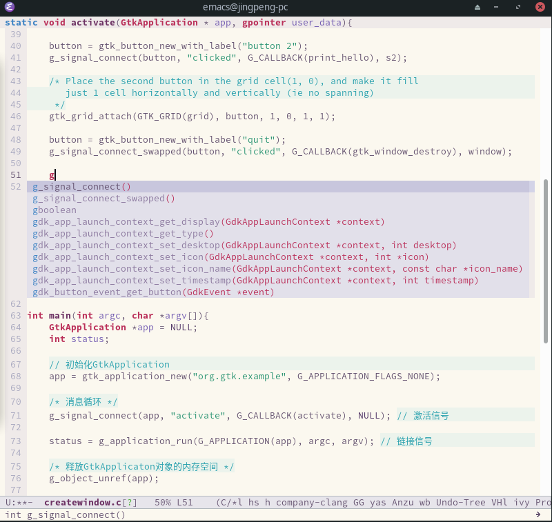
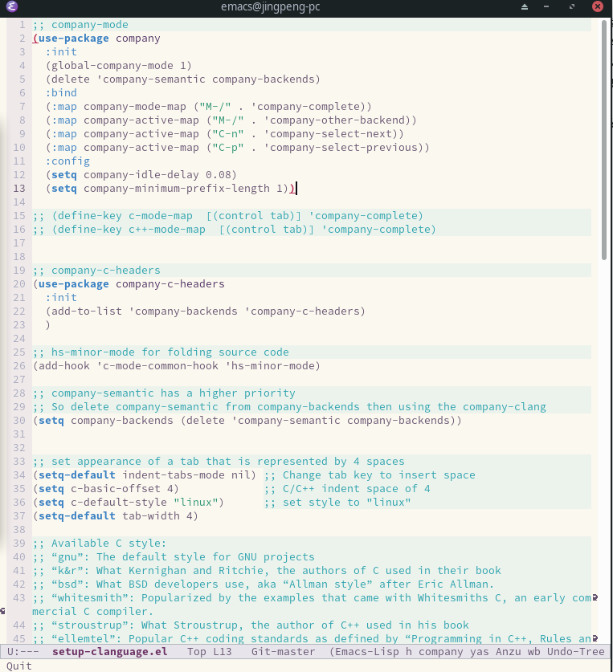

# 概述

这是一套精简, 功能基础, 可扩展的emacs配置文件, 可以基本作为C/C++开发主战编辑器.

2019年初, 我脱离win系统, 来到Linux的世界, 当时我只知道Linux是一个开源的, 我自己也是一个开源积极分子。

初到Linux, 当时开发编辑器选择一共有两个，后来我选择了emacs. 时间证明我选择Emacs编辑器是正确的. 

# 基本功能一览

## 1. 简洁的配置文件， 可定制性强

## 2. 默认启动了支持C/C++头文件的补全

## 3. 输入单字，既能够触发C/C++代码补全

## 4. company-mode 候选人默认移动方式: 

- <kbd>control</kbd> + <kbd>n</kbd> 下一个
- <kbd>control</kbd> + <kbd>p</kbd> 上一个

## 4. 可以自定义修改适合自己的配置

- 在配置文件下，有custom文件夹. 该文件夹内定义了一些自定义一lisp代码。
- 其中setup-clanguage.el是定义C/C++所有操作参数, 和按键绑定.
- 

## 修改补全参数  .emacs/custom/setup-clanguage.el

- 补全设置: (setq company-idle-delay 0.08) 
- 补全触发长度设置: (setq company-minimum-prefix-length 1)

# 功能简述

### 重要目录文件:

- custom    --- 定义了一些自定义的elisp代码, 控制着整个emacs编辑器
- elpa          --- 该文件夹存放着下载的插件
- snippets  --- 用于yasnippets插件 代码片段补全, 输入基本字母, 按TAB补全

# 附加小功能

<kbd>F2</kbd>  打开 **.emacs/init.el** 配置文件

